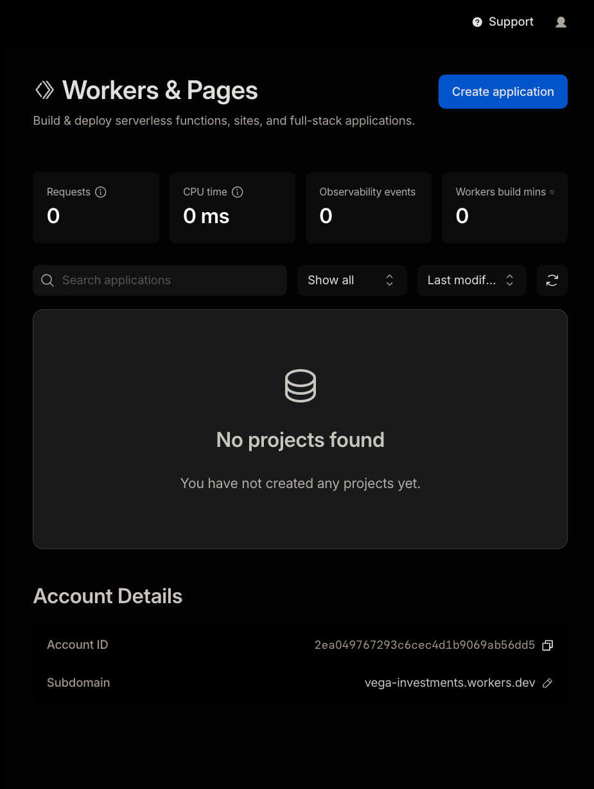

# Repo Setup Steps

Instructions given to bootstrap this repository.

---

## 1. Create a README

> "create a readme file, I want to deploy container apps in cloudflare,
> https://dash.cloudflare.com/2ea049767293c6cec4d1b9069ab56dd5/workers/containers"

- Target: Cloudflare Workers Containers (account `2ea049767293c6cec4d1b9069ab56dd5`)
- Output: `README.md` covering architecture, prerequisites, project structure, and deployment

---

## 2. Create a Makefile to build and deploy

> "Create a Makefile to build and deploy an app to Cloudflare"

- Output: `Makefile` with targets: `install`, `dev`, `deploy`, `logs`, `list`, `images`, `clean`
- `make deploy` runs `npx wrangler deploy` which builds the Docker image, pushes it to Cloudflare's registry, and deploys the Worker in one step

---

## 3. Create a Cloudflare API token

`wrangler deploy` requires a token with Workers write permissions. The `CLOUDFLARE_API_TOKEN` env var was already set but the token only had read access, causing:

```
Authentication error [code: 10000]
```

**Fix:** create a new token using the "Edit Cloudflare Workers" template:

1. Go to https://dash.cloudflare.com/profile/api-tokens
2. Click **Create Token** → use the **"Edit Cloudflare Workers"** template
3. Ensure the following permissions are included:
   - `Workers Scripts:Edit`
   - `Workers Containers:Edit`
   - `Account:Cloudflare Workers Containers:Edit`
   - `User:User Details:Read`
   - `User:Memberships:Read`
4. Set account scope to `vega_investments` (`2ea049767293c6cec4d1b9069ab56dd5`)
5. Export the token before deploying:

```bash
export CLOUDFLARE_API_TOKEN=<token>
make deploy
```

---

## 4. Create a workers.dev subdomain (one-time)

`wrangler deploy` failed with:

```
You need a workers.dev subdomain in order to proceed. [code: 10063]
```

**Fix:** visit the Workers landing page once to auto-create the subdomain:

1. Go to https://dash.cloudflare.com/2ea049767293c6cec4d1b9069ab56dd5/workers 
2. The page creates a `<name>.workers.dev` subdomain automatically on first load 
3. Run `make deploy` again — no config changes needed

---

## 5. Upgrade to Workers Paid plan (one-time)

`wrangler deploy` continued to fail with `Unauthorized` on `/containers/me` even after fixing token permissions and using OAuth. Root cause: **Cloudflare Containers requires the Workers Paid plan**.

```
-- START CF API REQUEST: .../containers/me
-- START CF API RESPONSE: Unauthorized 401
```

**Fix:**

1. Go to https://dash.cloudflare.com/2ea049767293c6cec4d1b9069ab56dd5/workers/plans
2. Upgrade to **Workers Paid** ($5/month)
3. Run `make deploy` again

---

## 6. Full project scaffold

Files generated to make the app deployable from scratch:

| File | Description |
|------|-------------|
| `wrangler.jsonc` | Wrangler config — worker name, account ID, container + Durable Object bindings |
| `package.json` | npm deps: `wrangler`, `hono`, `@cloudflare/containers` |
| `tsconfig.json` | TypeScript compiler config |
| `worker-configuration.d.ts` | Generated env types for the Worker |
| `src/index.ts` | Worker entry point (Hono router → container instances) |
| `Dockerfile` | Multi-stage Go build → scratch image, port 8080 |
| `container_src/main.go` | Go HTTP server running inside the container |
| `container_src/go.mod` | Go module file |
| `.gitignore` | Ignores `node_modules`, `.wrangler`, `.env*` |
